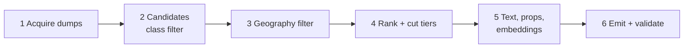

# OxidDB Neurosymbolic DBpedia Dataset: Build Briefing

2026-09-17, decisions revised 2026-09-18, sources and layout aligned with the implementation 2026-09-18

## Purpose

One Python pipeline produces a single neurosymbolic dataset in three nested tiers: 50K, 100K and 180K entities. Every entity carries its DBpedia IRI, title, abstract, selected properties, ontology types and a 1536-dim vector, all keyed on the same identifier.

The scope is internationally known Western European and American entities: people (scientists, artists, athletes, writers), places, organisations, creative works and events. Entities from other regions and low-notability entries are excluded, so demo queries return results the target audience recognises.

Tiers are strict prefixes of one ranked list. The 50K tier is fully contained in the 100K tier, which is fully contained in the 180K tier. Growing a tier widens the knowledge without changing anything already in it.

The tiers exist for one reason: three sizes of the same data, so load time, index build time, query latency, memory and cost can be compared across scale. No other meaning is attached to them.

| Tier | Entities | Raw vectors (1536 x float32) |
| --- | --- | --- |
| T50 | 50,000 | ~0.29 GB |
| T100 | 100,000 | ~0.57 GB |
| T180 | 180,000 | ~0.84 GB |   <!-- was 200,000; capped 2026-09-19 to the pool above the notability floor (184,762) -->

## Key decision: build from DBpedia, embed ourselves

The entity set is selected from DBpedia first, then embedded with `text-embedding-3-small`. Filtering the Qdrant vector sets does not work for this goal.

**Why the Qdrant sets fail here:**

- The Qdrant 1M set is the *first* 1M rows of BeIR/dbpedia-entity, not a notability ranking. Many famous Western entities are simply not in it, and it cannot be extended to fill a quota.
- After class, geography and notability filters, the surviving pool from a 1M slice is unpredictable and may not reach 200K good entities.
- The 100K set is likely ada-002 while the 1M set is `text-embedding-3-large` truncated to 1536. Mixing them breaks vector comparability.
- The BeIR id may not be a canonical DBpedia IRI, which makes every join fragile.

**Why embedding ourselves is cheap:** 180K entities at about 100 tokens each (measured) is about 19M tokens. At `text-embedding-3-small` pricing that is under half a dollar, less through the Batch API. One model, one version, full control.

**Consequence for the three-act demo:** Act 1 argued parity "on Qdrant's own dataset". This custom dataset loses that claim. Options:

1. Keep the Qdrant 100K set for Act 1 parity only, and use this dataset for Acts 2 and onward and the playground. Costs the no-reset continuity between Act 1 and Act 2.
2. Use this dataset everywhere and run Qdrant and Weaviate on it too. Parity becomes "same data, same vectors, all engines", which is arguably fairer. Loses the "their own dataset" line.

Recommendation: option 2. The pipeline publishes the dataset, so competitors can load it themselves, and the no-reset constraint survives.

**Decided (2026-09-18): option 2.** This dataset is used everywhere: every act, the playground, and every engine in the parity comparison.

## Sources and version pinning

All inputs come from one DBpedia snapshot release on the DBpedia Databus, plus Wikimedia pageview dumps and one embedding model. Artifact names, URLs and SHA-256 hashes were verified on the Databus on 2026-09-18 and are pinned in `config.toml`. Snapshot `2022.12.01` is the latest Databus release; the ontology is published separately through DBpedia Archivo.

| Input | Source | Used for | Pin |
| --- | --- | --- | --- |
| DBO ontology | Databus `ontologies/dbpedia.org/ontology` (Archivo), `ontology_type=parsed.nt` | TBox: classes, subclass axioms, properties | `2024.08.01-180007` |
| Instance types | Databus `dbpedia/mappings/instance-types` (en, `specific`) | Most-specific `rdf:type` per entity | `2022.12.01` |
| Mapping-based objects | Databus `dbpedia/mappings/mappingbased-objects` (en) | Entity-to-entity edges, geography | Snapshot release |
| Mapping-based literals | Databus `dbpedia/mappings/mappingbased-literals` (en) | Dates, numbers, coordinates | Snapshot release |
| Short abstracts | Databus `dbpedia/text/short-abstracts` (en) | Text field and embedding input | Snapshot release |
| Wikidata sameAs | Databus `dbpedia/wikidata/sameas-all-wikis` | Language count and per-language titles for the pageview join | `2022.12.01` |
| Disambiguations, redirects | Databus `dbpedia/generic/disambiguations`, `dbpedia/generic/redirects` (en, transitive) | Drop disambiguation and redirect pages; canonicalise object IRIs | `2022.12.01` |
| Pageviews | Wikimedia `pageview_complete` monthly `-user` dumps (about 5.6 GB each) | Notability signal, per-language views | 12 fixed months |
| Embeddings | OpenAI `text-embedding-3-small`, 1536 dims | Vector field | Model name + run date |

Rules:

- One snapshot for every DBpedia file. Mixing releases produces IRIs that do not join.
- English chapter only for types, properties and abstracts. Other language editions contribute only notability signals.
- Every pinned version goes into `manifest.json` (see Output).
- The generic `interlanguage-links` file for English only lists pages without a Wikidata mapping (820 KB), so the language count comes from the Wikidata sameAs file instead.
- DBpedia names its dumps `.ttl.bz2`, but the content is one full-IRI triple per line, so a line parser is used instead of a Turtle parser.

## Pipeline overview

Six stages, each a separate script that reads the previous stage's Parquet output. Every stage is idempotent and cached, so a filter change reruns only from that stage onward.



Embedding runs only once, on the T180 set. T50 and T100 are cut from the same embedded file, so vectors are identical across tiers.

Layout (as implemented):

```
oxid-dbpedia-ns/
  config.toml            # sources, buckets and shares, countries, floor, properties, tier sizes
  data/country_map.csv   # historic states, demonyms, aliases -> modern country
  oxid_dbpedia_ns/       # package: stages/, ntriples parser, ontology tools, embeddings, cli
  01_acquire.py ... 07_validate.py   # thin wrappers around `oxid-dbpedia-ns <stage>`
  loader/oxiddb_load.py  # standalone OxidDB loader with the smoke tests
  tests/                 # unit tests + synthetic end-to-end fixture
  cache/                 # downloaded dumps and their Parquet conversions, never committed
  work/                  # per-stage Parquet
  out/                   # final tiers
```

Stack: Python 3.12 via `uv`, `polars` for joins, `pyarrow` for Parquet, a streaming line parser for N-Triples (rdflib is too slow at this volume; it is used only for the small ontology), `openai` client with the Batch API. Decompress `.bz2` with `lbzip2` when installed, `bzip2` otherwise.

## Stage 1: Acquisition

`01_acquire.py` downloads every pinned input into `cache/`, verifies checksums and converts each triple file to Parquet once. Later stages never touch raw dumps.

1. Resolve download URLs from the Databus for the pinned snapshot. Store URL, size and SHA-256 per file.
2. Download with resume support. The full English mapping files are several GB compressed; budget 20 to 40 GB of disk for `cache/`.
3. Pageviews: download 12 monthly `pageview_complete` `-user` files. Rows are `wiki_code title page_id access_method monthly_total daily_string`; the file is piped through `bzip2 | grep` so only the en, de, fr, nl, es, it, pt, sv, da, no, fi rows reach Python, where views are summed per (language, title) over desktop, mobile-web and mobile-app. Discard the raw files after aggregation.
4. Parse N-Triples line by line into Parquet with columns `s`, `p`, `o`, `o_is_iri`, `lang`, `datatype`.
5. Normalise IRIs once, here: percent-decoding rules, `http` not `https`, no trailing slash. Write the normaliser as one tested function reused by every stage.

**Failure mode:** IRI normalisation drift. If the abstracts file encodes `Caf%C3%A9` and the types file uses `Café`, joins silently drop entities. Stage 1 logs a sample of 1,000 IRIs per file for manual comparison.

## Stage 2: Candidate pool and class filter

`02_candidates.py` keeps every entity that has an English abstract and a most-specific type inside one of the configured buckets. Each entity lands in exactly one bucket.

Steps:

1. Compute the subclass closure of DBO in Python (a plain transitive closure over `rdfs:subClassOf`).
2. Map each entity's most-specific type upward until it hits a bucket root. The first bucket hit wins; bucket order in `config.toml` breaks ties.
3. Drop entities with no abstract, no bucket, a title starting with `List of`, or a disambiguation or redirect marker.
4. Record `bucket` and `most_specific_type` per entity.

Default buckets and quota shares. Quotas are shares of each tier, so all three tiers keep the same mix.

| Group | Bucket (DBO roots) | Share |
| --- | --- | --- |
| People | Scientist | 6% |
| People | Artist (painters, sculptors, photographers) | 5% |
| People | MusicalArtist, Band | 7% |
| People | Writer | 5% |
| People | Athlete (all sports) | 10% |
| People | Actor, film directors | 3% |
| Places | City, Town | 10% |
| Places | Country, AdministrativeRegion | 2% |
| Places | Building, HistoricPlace, Museum | 6% |
| Places | Mountain, River, Lake | 4% |
| Organisations | Company | 7% |
| Organisations | University | 3% |
| Organisations | SportsTeam | 3% |
| Organisations | Other organisations | 2% |
| Works | Film | 5% |
| Works | Album, Single | 3% |
| Works | Book | 3% |
| Works | TelevisionShow | 2% |
| Works | Artwork, VideoGame | 2% |
| Events | MilitaryConflict, SportsEvent, other events | 5% |
| Other | Automobile, Aircraft, Food | 3% |

Politician and Royalty are not a bucket (decision of 2026-09-18), to keep politically charged results out of the demo. An entity whose most-specific type resolves to Politician or Royalty gets no bucket and is dropped in step 3. The shares above sum to 96%; Stage 4 renormalises them to 100%, so every remaining bucket grows by the same factor and no number in this table needs hand-editing.

**Why quotas:** a pure notability ranking is dominated by footballers, cities and pop albums, because those have the most pages and views. Quotas keep scientists and artworks visible, which makes class-scoped demo queries meaningful.

**Why one bucket per entity:** it keeps quota accounting exact. Multi-class membership still exists in the ontology output; the bucket is only a sampling label.

## Stage 3: Geography filter

`03_geography.py` resolves each candidate to zero or more countries and keeps it when any resolved country is in the target set. Class filtering alone cannot do this: an Indian cricketer is still an Athlete.

**Default target set** (in `config.toml`): Austria, Belgium, Denmark, Finland, France, Germany, Iceland, Ireland, Italy, Liechtenstein, Luxembourg, Monaco, Netherlands, Norway, Portugal, Spain, Sweden, Switzerland, United Kingdom, United States. Canada is out. Central Europe (Poland, Czechia, Hungary) and Greece are out (decision of 2026-09-18).

**Resolution properties per group:**

| Group | Properties tried, in order |
| --- | --- |
| People | `nationality`, `citizenship`, `birthPlace`, `team` (athletes) |
| Places | `country`, then `isPartOf` chain |
| Organisations | `locationCountry`, `country`, `headquarter`, `location` |
| Works | `country`, `author` / `director` / `artist` (resolved as a person) |
| Events | `place`, `location`, `country` |
| Other | `manufacturer` / `origin`, resolved as an organisation or place |

**Resolution rules:**

1. A property pointing at a place is walked up via `country` or `isPartOf`, maximum 3 hops, until it reaches a country IRI.
2. Historic states map to modern countries through a hand-kept table: West Germany, Kingdom of Prussia, Kingdom of England, Dutch Republic and similar. Start with about 40 entries and grow it from the rejection log.
3. An entity passes if **any** resolved country is in the set. A German-born NBA player passes; an Indian-born cricketer does not.
4. Works inherit geography from their creator when they have no `country`. That keeps paintings and novels, which rarely carry a country.

**Unresolved entities** (no country found): pass only if they have articles in at least 4 of the 10 target non-English editions (de, fr, nl, es, it, pt, sv, da, no, fi). This keeps widely covered concepts and events without a location, and drops long-tail items.

**Diagnostics:** write `work/geo_rejected.parquet` with the reason per entity. Review a random sample of 200 rejections before trusting the filter. Expect the historic-state table to need a second pass.

## Stage 4: Notability ranking and nested tiers

`04_rank.py` produces one global order of entities. T50, T100 and T180 are its first 50K, 100K and 180K rows, so nesting is guaranteed by construction.

**Notability score per entity:**

`score = 0.6 * z(log1p(views)) + 0.4 * z(log1p(languages))`

- `views` = 12-month pageviews summed over English and the 10 target editions.
- `languages` = number of Wikipedia editions with an article (interlanguage links).
- `z` = z-score within the entity's bucket, so a famous painter competes with painters, not footballers.

The two signals balance each other. Pageviews favour current celebrities; language count favours historically established entities like Rembrandt or the Treaty of Versailles.

**Quota-preserving interleave:**

1. Sort each bucket by score, descending; break ties on IRI so reruns are deterministic.
2. Build the global order one entity at a time. At step `k`, pick the bucket with the largest deficit `share_b * k - taken_b` and take its next entity.
3. Result: in any prefix of length N, each bucket holds `share_b * N` entities, within one.

**Floor and underflow:** a bucket stops contributing when its next entity falls below a minimum notability floor (starting values: 5,000 views a year and 5 languages, tuned after the pre-flight report) or its pool is empty. Its remaining share is redistributed proportionally over the other buckets, and the event is logged with the step number. Without the floor, small buckets would pull obscure entries into T180 just to meet quota.

**Pre-flight check:** before ranking, print each bucket's pool size above the floor against its T180 demand (`share_b * 180,000`). Scientist needs 11,250; Athlete needs 18,750. Any shortfall gets resolved in `config.toml` before continuing, not silently.

Output: `work/ranked.parquet` with `rank`, `iri`, `bucket`, `score`, `views`, `languages`, plus a `tier_min` column (50, 100 or 200).

## Stage 5: Abstracts, properties and embeddings

`05_enrich_embed.py` runs on the T180 set only and attaches everything each record needs. T50 and T100 reuse the result.

**Text**

- `title` = the Wikipedia title with underscores replaced by spaces.
- `abstract` = the English short abstract, whitespace-normalised, otherwise untouched.
- `embed_text` = `title + "\n" + abstract`. Stored as-is, so anyone can reproduce the vector.

**Properties** (whitelist per group, in `config.toml`)

| Group | Literal properties | Object properties |
| --- | --- | --- |
| People | `birthDate`, `deathDate` | `birthPlace`, `deathPlace`, `nationality`, `almaMater`, `team`, `award` |
| Places | `populationTotal`, `areaTotal`, coordinates | `country`, `isPartOf` |
| Organisations | `foundingYear`, `numberOfEmployees` | `headquarter`, `founder`, `industry` |
| Works | `releaseDate`, `runtime` | `author`, `director`, `artist`, `starring`, `genre` |
| Events | `date` | `place`, `commander` |

Object properties are stored as edges. An edge whose target is outside T180 is dropped from the graph, but its target label is kept as a display string (for example `birthPlace_label`). That preserves readable detail without dangling IRIs.

**Embeddings**

1. Model `text-embedding-3-small`, native 1536 dimensions, no truncation.
2. Submit through the OpenAI Batch API in files of at most 50,000 requests. Checkpoint each completed batch to `work/vectors/part-NNN.parquet`.
3. Store as `float32`. Check the L2 norm of every vector is 1.0 within 1e-3; OpenAI vectors are unit-normalised.
4. Record model name, dimension, request date and total tokens in the manifest.

Cost, measured on the real abstracts: 95 to 105 cl100k tokens per `embed_text`. The 2026-09-19 build embedded 184,762 entities (the full pool above the floor) for 19,139,607 tokens = $0.19 through the Batch API at $0.01 per 1M tokens for `text-embedding-3-small`, half the $0.02 standard rate. `text-embedding-3-large` would be $2.60. The earlier 30M to 50M estimate was too high.

## Stage 6: Output format

`06_emit.py` writes one self-contained directory per tier. Parquet carries the records and vectors; N-Triples and OWL carry the symbolic side, so each half loads with standard tools.

```
out/
  t50/  t100/  t180/
    entities.parquet     # one row per entity, vector included
    edges.parquet        # s, p, o between entities in this tier
    abox.nt              # rdf:type + edges + literals, N-Triples
    tbox.owl             # DBO, filtered to the OWL 2 EL profile
    tbox_removed.owl     # axioms stripped for EL compliance
    types_inferred.parquet  # subclass closure of the asserted types, for validation only
    oxid_tbox.txt        # OxidDB line import: SUBCLASS
    oxid_abox.txt        # OxidDB line import: INSTANCE, PROPERTY
    manifest.json
    ATTRIBUTION.md
  README.md              # dataset card (Hugging Face front matter), generated from the manifests
  LICENSE                # CC BY-SA 4.0 notice
```

**`entities.parquet` schema**

| Column | Type | Notes |
| --- | --- | --- |
| `iri` | string | Canonical DBpedia IRI, the shared key |
| `rank` | int32 | Global rank from Stage 4 |
| `tier_min` | int8 | 50, 100 or 200 |
| `title` | string | |
| `abstract` | string | |
| `embed_text` | string | Exact embedding input |
| `bucket` | string | Sampling label |
| `types` | list\<string> | Asserted most-specific DBO types |
| `countries` | list\<string> | Resolved in Stage 3 |
| `props` | struct | Whitelisted literals and `*_label` strings |
| `score`, `views`, `languages` | float / int | Notability signals |
| `vector` | fixed_size_list\<float32, 1536> | |

**Edge membership:** an edge belongs to tier T when both endpoints have `tier_min <= T`. Edge sets therefore grow with the tiers, just like entities.

**Types:** `abox.nt` contains asserted types only (plus `rdfs:label`). OxidDB derives the superclasses itself; `types_inferred.parquet` is the subclass closure of the asserted types over the EL TBox and serves as the oracle for checking OxidDB's classification. For DBO, whose EL fragment is a plain class hierarchy with a few existential restrictions, this closure equals what ELK computes; an ELK run can replace it later without changing the file format.

**OxidDB import files:** OxidDB has no RDF importer. Its `/import/csv` endpoint takes whitespace-separated `SUBCLASS`, `INSTANCE` and `PROPERTY` lines, so every tier ships `oxid_tbox.txt` and `oxid_abox.txt` in that format next to the standard RDF files, and `loader/oxiddb_load.py` streams them in 10,000-line chunks under the server's 2 MB body cap.

**EL profile:** run an OWL 2 EL profile check on DBO and move non-compliant axioms (for example functional or inverse property axioms) into `tbox_removed.owl`. The manifest lists the count, so nobody is surprised.

**TBox cleaning (added 2026-09-18 after checking against OxidDB 0.9.9):** before the EL filter, `clean_tbox` removes three DBO artefacts that are noise for a demo and that make a reasoner disagree with the pipeline's closure: about 11,000 triples about Urdu-localised duplicate classes and properties (non-ASCII local names, shipped as `\uXXXX` escapes inside IRIs), 20 `rdfs:subClassOf` axioms whose object is a property rather than a class (`dbo:Hospital ⊑ dbo:building`), and superclass or equivalence links into schema.org, DUL and Wikidata. Non-English labels and comments go too. What remains is 788 classes and 2,215 inferred subsumptions, and OxidDB's offline `oxd hierarchy` and `oxd extents` commands reproduce both the subsumptions and `types_inferred.parquet` exactly (`loader/oxd_oracle.py`). That makes `types_inferred.parquet` a verified oracle without needing ELK.

**`manifest.json`:** pinned source versions and checksums, config hash, embedding model and date, entity and edge counts, per-bucket and per-country counts, and SHA-256 of every output file.

Tier sizes on disk, measured on the 2026-09-19 build: T50 0.26 GB, T100 0.48 GB, T180 0.84 GB, dominated by vectors.

## Validation

`07_validate.py` fails the build on any hard check and prints a report for the soft checks. A tier is not published until both pass.

**Hard checks (build fails)**

- [ ] Nesting: every IRI in T50 is in T100, every IRI in T100 is in T180, and ranks match across tiers.
- [ ] Tier sizes are exactly 50,000, 100,000 and 180,000.
- [ ] No duplicate IRIs; every IRI matches the canonical pattern.
- [ ] Every entity has a non-empty abstract, at least one type and a 1536-dim vector with norm 1.0 within 1e-3.
- [ ] Every edge endpoint exists in that tier's `entities.parquet`.
- [ ] Every type in `abox.nt` exists as a class in `tbox.owl`.
- [ ] Vectors for the same IRI are byte-identical in all three tiers.
- [ ] Manifest checksums match the files.

**Soft checks (report, human review)**

- Bucket shares per tier within 1 percentage point of `config.toml`, with any underflow events listed.
- Country distribution per tier. Flag if the United States exceeds 50%, which would make the European story thin.
- Target-set leakage: sample 200 entities and confirm by eye that none are clearly outside the target regions.
- Notability sanity: the top 20 per bucket should be household names (Einstein, Picasso, Paris, Volkswagen).
- Tail sanity: sample 50 entities from ranks 170K to 180K; most should still be recognisable to a European or American audience.
- Semantic smoke test: nearest neighbours for 10 fixed probes ("Albert Einstein", "Eiffel Tower", "Ajax Amsterdam", "The Beatles") look sensible.
- Neurosymbolic smoke test: a class-scoped query like "artists similar to Van Gogh, restricted to inferred `dbo:Painter`" returns only painters in OxidDB, matching the ELK closure.

## Licensing and attribution

Publish the dataset under CC BY-SA, because the abstracts, types and properties derive from DBpedia and Wikipedia, which are CC BY-SA. The pipeline code can carry its own license (Apache 2.0 or MIT) separately. Not a lawyer; confirm before a public release.

- `ATTRIBUTION.md` in every tier credits DBpedia and Wikipedia contributors, names the snapshot release, and links to the source datasets.
- Wikimedia pageview dumps are released as CC0; only the derived score is shipped.
- Embeddings are generated output under the OpenAI terms and ship inside the CC BY-SA dataset.
- Record the license string in `manifest.json` and in the Hugging Face dataset card if published there.

## Publication plan

Order of work: build, validate, load into OxidDB, then publish. Nothing goes public before a tier has run inside OxidDB.

1. Build T180 and pass every hard check in `07_validate.py`.
2. Load T50 into an OxidDB instance with `loader/oxiddb_load.py out/t50 --smoke` and read its report. The loader (verified against OxidDB 0.9.9 on 2026-09-18 with the synthetic tiers) imports `tbox.ttl` directly, upserts classes, literals, edges and vector per entity through `POST /entities/batch`, classifies once and runs the semantic and neurosymbolic smoke tests, checking both the class-scoped query and the probe's server-side inferred classes against `types_inferred.parquet`. `loader/oxd_oracle.py` additionally diffs OxidDB's offline reasoner against the tier files. Fix the pipeline until everything passes, then load T100 and T180; for T180 prefer the in-process Rust ingester from the Oxid-DB repo, since the HTTP path fsyncs per commit.
3. Tag a release and publish code and data together under that tag.

Prepare for step 3 from the first commit, so publishing is a checklist and not a rewrite:

- Code and data are separate. The pipeline lives in git; `cache/`, `work/` and `out/` are gitignored from day one.
- No secrets in the repo. The OpenAI key comes from an environment variable; `config.toml` holds nothing private.
- `LICENSE` (Apache 2.0 or MIT) for the code. `LICENSE-DATA` (CC BY-SA 4.0) and `ATTRIBUTION.md` in every tier directory, written now, not at release time.
- `06_emit.py` generates a dataset card (`README.md` with YAML front matter: license, language, size category, per-tier schema, embedding model and date) from `manifest.json`, so the card never drifts from the data.
- A standalone loader script for OxidDB that reads a tier directory, so the published artefact is usable without cloning the pipeline.
- Reproducibility: the manifest pins every input; a stranger with an OpenAI key reruns the pipeline and gets the same entity set, edges and ranks. Vectors may differ in the last bits between embedding runs, which the manifest date documents.

Where to publish:

| Venue | Use it for | Why |
| --- | --- | --- |
| Hugging Face Datasets | The data, primary home | Free hosting for public datasets, Parquet-native viewer, `load_dataset` support, git versioning, license in metadata. One dataset repo with `t50`, `t100` and `t180` as configs. |
| GitHub | Code, config, manifests, loader | Not for the data: LFS caps files at 2 GB on the free plan and the free quota is small. The README links to the Hugging Face dataset. |
| Zenodo | Citable snapshot for the thesis | Mints a DOI per release, holds up to 50 GB per record, versions are immutable. The GitHub release integration can create it automatically from the tag. |
| Object storage (S3, R2, B2) | Plain download URLs | Only if the OxidDB loader needs raw HTTP URLs. Costs money and offers no discovery, so optional. |

Recommendation: GitHub for the code, Hugging Face for the data, and a Zenodo DOI minted from the first tagged release. Publish the same tag in all three so the thesis, the demo and the repo point at one version.

## Decisions

Resolved on 2026-09-18:

- [x] Act 1 parity: this dataset everywhere. Qdrant and Weaviate load the same tiers, so parity is "same data, same vectors, all engines".
- [x] Geography: the Stage 3 default set. Central Europe (Poland, Czechia, Hungary) and Greece are out. Polish is removed from the notability edition list to match, leaving 10 non-English editions.
- [x] Politicians and royalty: out. The bucket is removed; its 4% is absorbed by renormalising the remaining shares.
- [x] Quota table: defaults accepted as listed.
- [x] Notability floor: 5,000 views a year and 5 languages as starting values, tuned after the pre-flight report.
- [x] Publication: get the pipeline working and a tier loaded into an OxidDB instance first, then publish publicly. Build as if public from day one; see Publication plan.
- [x] Tiers: three sizes of the same data so time, cost, memory and latency can be compared across scale. Nothing more is attached to them.

Still open:

- [ ] Confirm the CC BY-SA 4.0 data license with someone qualified before the public release.
- [ ] Choose the final release venue at tag time; the recommendation above is GitHub + Hugging Face + Zenodo.
